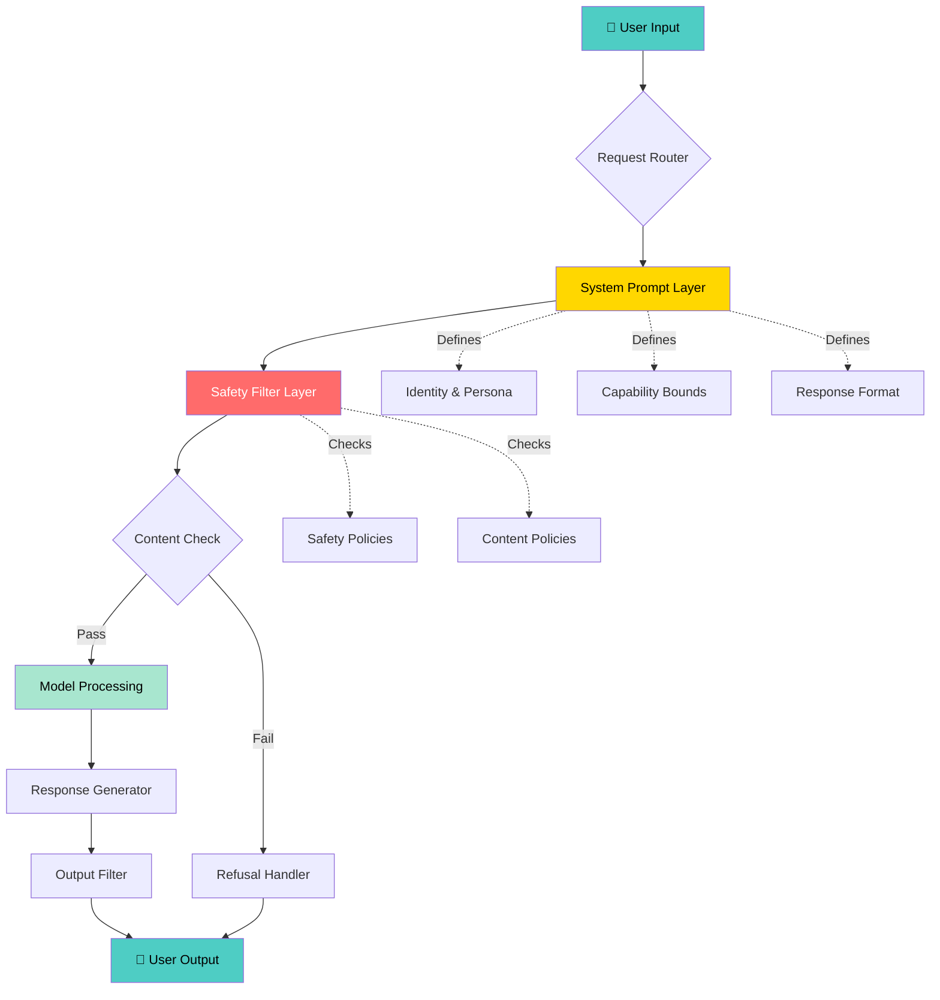
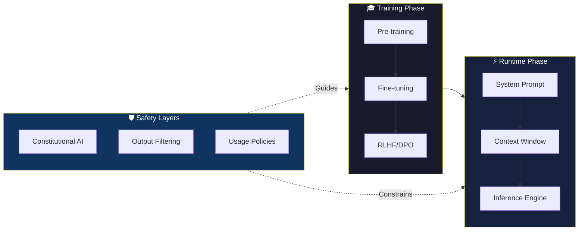
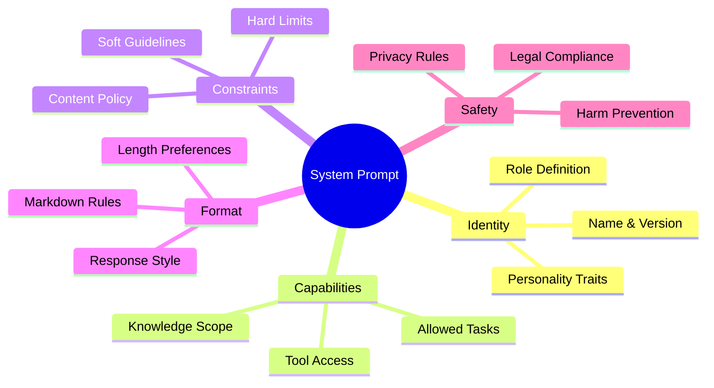

```
╔═══════════════════════════════════════════════════════════════════════════════╗
║                                                                               ║
║    █████╗ ██╗    ███████╗██╗   ██╗███████╗████████╗███████╗███╗   ███╗       ║
║   ██╔══██╗██║    ██╔════╝╚██╗ ██╔╝██╔════╝╚══██╔══╝██╔════╝████╗ ████║       ║
║   ███████║██║    ███████╗ ╚████╔╝ ███████╗   ██║   █████╗  ██╔████╔██║       ║
║   ██╔══██║██║    ╚════██║  ╚██╔╝  ╚════██║   ██║   ██╔══╝  ██║╚██╔╝██║       ║
║   ██║  ██║██║    ███████║   ██║   ███████║   ██║   ███████╗██║ ╚═╝ ██║       ║
║   ╚═╝  ╚═╝╚═╝    ╚══════╝   ╚═╝   ╚══════╝   ╚═╝   ╚══════╝╚═╝     ╚═╝       ║
║                                                                               ║
║          ██████╗ ██████╗  ██████╗ ███╗   ███╗██████╗ ████████╗███████╗       ║
║          ██╔══██╗██╔══██╗██╔═══██╗████╗ ████║██╔══██╗╚══██╔══╝██╔════╝       ║
║          ██████╔╝██████╔╝██║   ██║██╔████╔██║██████╔╝   ██║   ███████╗       ║
║          ██╔═══╝ ██╔══██╗██║   ██║██║╚██╔╝██║██╔═══╝    ██║   ╚════██║       ║
║          ██║     ██║  ██║╚██████╔╝██║ ╚═╝ ██║██║        ██║   ███████║       ║
║          ╚═╝     ╚═╝  ╚═╝ ╚═════╝ ╚═╝     ╚═╝╚═╝        ╚═╝   ╚══════╝       ║
║                                                                               ║
║                    L I B R A R Y                                              ║
║          The World's Most Comprehensive AI System Prompt Collection           ║
╚═══════════════════════════════════════════════════════════════════════════════╝
```

<div align="center">

[](https://github.com/vibhor-777/ai-system-prompts-library/stargazers)
[](https://github.com/vibhor-777/ai-system-prompts-library/network/members)
[](LICENSE)
[](https://github.com/vibhor-777/ai-system-prompts-library/graphs/contributors)
[](https://github.com/vibhor-777/ai-system-prompts-library/commits/main)
[](https://github.com/vibhor-777/ai-system-prompts-library/issues)

[](https://git.io/typing-svg)

**The most comprehensive, research-grade collection of AI system prompt reconstructions, behavioral analyses, and prompt engineering resources for the open-source community.**

[🚀 Quick Start](#-how-to-use) • [📖 Browse Prompts](#-directory-structure) • [🔬 Research](#jailbreak-research) • [🛠️ Tools](#️-tools) • [🤝 Contribute](#-contributing)

</div>

---

## 📋 Table of Contents

| Section | Description |
|---------|-------------|
| [🧠 What is this?](#-what-is-this) | Overview and mission |
| [💡 Why System Prompts Matter](#-why-system-prompts-matter) | The importance of prompt transparency |
| [🏗️ Architecture](#️-architecture) | System design and prompt flow |
| [📊 Model Comparison](#-model-comparison-table) | Side-by-side AI model analysis |
| [📁 Directory Structure](#-directory-structure) | Repository organization |
| [🚀 How to Use](#-how-to-use) | Getting started guide |
| [⭐ Featured Prompt of the Week](#-featured-prompt-of-the-week) | Spotlight on notable prompts |
| [🔥 Trending Configs](#-trending-configs) | Most popular configurations |
| [🤝 Contributing](#-contributing) | How to contribute |
| [📜 License](#-license) | Licensing information |

---

## 🧠 What is this?

> **AI System Prompts Library** is an open-source research repository dedicated to transparency in AI systems through the careful study, reconstruction, and analysis of system prompts used by major AI models.

This repository contains:

- 🔍 **Research Reconstructions** — Carefully analyzed reconstructions of system prompts based on publicly available information, model behavior studies, and official documentation
- 🧪 **Behavioral Analysis** — Deep dives into how different system prompts affect model behavior, safety measures, and output quality
- ⚙️ **Agent Configurations** — Production-ready agent configuration templates for various use cases
- 🔬 **Security Research** — Educational analysis of prompt injection, jailbreak patterns, and defense mechanisms
- 🛠️ **Developer Tools** — CLI tools, Web UI, and APIs for working with prompts programmatically
- 📊 **Comparative Studies** — Side-by-side analysis of how different models respond to identical prompts

> ⚠️ **Important**: All content in this repository is for **educational and research purposes only**. System prompt reconstructions are based on publicly available information, model documentation, and behavioral analysis — not proprietary leaks.

---

## 💡 Why System Prompts Matter

System prompts are the invisible foundation of every AI interaction. They determine:

```
┌─────────────────────────────────────────────────────────┐
│                  THE PROMPT STACK                        │
├─────────────────────────────────────────────────────────┤
│  🎯  Identity & Persona    → Who the AI thinks it is    │
│  🛡️  Safety Guardrails     → What the AI won't do       │
│  📏  Response Format       → How the AI structures text │
│  🌐  Knowledge Boundaries  → What the AI claims to know │
│  🤝  Interaction Style     → How the AI engages users   │
│  🔐  Permission Levels     → What users can/cannot do   │
└─────────────────────────────────────────────────────────┘
```

Understanding system prompts enables:
- **Researchers** to study AI alignment and safety mechanisms
- **Developers** to build better AI-powered applications
- **Policy makers** to understand AI governance challenges
- **Users** to make informed decisions about AI tools they use
- **Educators** to teach AI literacy and critical thinking

---

## 🏗️ Architecture

### Prompt Flow Diagram



### AI Alignment Layers



### System Prompt Architecture



---

## 📊 Model Comparison Table

| Feature | GPT-4o | Claude 3.5 Sonnet | Gemini 1.5 Pro | LLaMA 3.1 | Mistral Large | Grok-2 |
|---------|--------|-------------------|----------------|-----------|---------------|--------|
| **System Prompt Visible** | ❌ | ❌ | ❌ | ✅ (open) | ✅ (open) | ❌ |
| **Safety Level** | 🔴 High | 🔴 Very High | 🟡 High | 🟢 Configurable | 🟢 Configurable | 🟡 Moderate |
| **Context Window** | 128K | 200K | 1M | 128K | 128K | 128K |
| **Identity Disclosure** | Partial | Partial | Partial | Full | Full | Partial |
| **Persona Flexibility** | Medium | Low | Medium | High | High | High |
| **Refusal Verbosity** | Medium | High | Medium | Low | Low | Low |
| **System Prompt Length** | ~5K tokens | ~8K tokens | ~3K tokens | Varies | Varies | ~4K tokens |
| **Constitutional AI** | ❌ | ✅ | Partial | ❌ | ❌ | ❌ |
| **Multi-modal** | ✅ | ✅ | ✅ | Partial | ❌ | ✅ |
| **Tool Use** | ✅ | ✅ | ✅ | ✅ | ✅ | ✅ |
| **Alignment Method** | RLHF | RLHF+CAI | RLHF | RLHF | DPO | RLHF |
| **Open Source** | ❌ | ❌ | ❌ | ✅ | ✅ | ❌ |

---

## 📁 Directory Structure

```
ai-system-prompts-library/
├── 📄 README.md                          # This file
├── 📄 LICENSE                            # MIT License
├── 📄 CONTRIBUTING.md                    # Contribution guidelines
├── 📄 DISCLAIMER.md                      # Legal disclaimer
├── 📄 CHANGELOG.md                       # Version history
├── 📄 PROMPTS_INDEX.md                   # Searchable prompt index
│
├── 🖼️ assets/
│   ├── banners/                          # Repository banners
│   ├── diagrams/                         # Architecture diagrams
│   └── previews/                         # Prompt previews
│
├── 🤖 prompts/
│   ├── openai/                           # GPT-4, GPT-4o, o1 prompts
│   │   ├── system_prompt.md
│   │   ├── behavior.md
│   │   ├── examples.md
│   │   ├── risks.md
│   │   └── metadata.json
│   ├── anthropic/                        # Claude family prompts
│   ├── google/                           # Gemini family prompts
│   ├── meta/                             # LLaMA family prompts
│   ├── mistral/                          # Mistral family prompts
│   ├── xai/                              # Grok prompts
│   └── open-source/                      # Community models
│
├── ⚙️ agent-configs/
│   ├── god-mode/                         # Unrestricted agent config
│   ├── developer-mode/                   # Dev-focused config
│   ├── safe-mode/                        # Maximum safety config
│   └── autonomous-agent/                 # Self-directed agent config
│
├── 🔬 jailbreak-research/
│   ├── README.md
│   ├── attack-patterns/                  # Known attack vectors
│   ├── defense-techniques/               # Mitigation strategies
│   └── case-studies/                     # Documented case studies
│
├── 📊 comparisons/
│   ├── model-vs-model.md                 # Cross-model comparisons
│   └── alignment-differences.md          # Safety approach analysis
│
├── 🛠️ tools/
│   ├── prompt-cli/                       # Command-line interface
│   │   ├── package.json
│   │   └── src/
│   │       ├── index.js
│   │       ├── commands/
│   │       └── utils/
│   ├── web-ui/                           # React web interface
│   │   ├── package.json
│   │   ├── src/
│   │   └── index.html
│   └── diff-engine/                      # Prompt diff tool
│
└── 🌐 api/
    └── prompts-api/                      # REST API server
        ├── package.json
        ├── server.js
        └── routes/
```

---

## 🚀 How to Use

### Option 1: Browse Online

Simply navigate the repository structure above. All prompts are in markdown format for easy reading.

### Option 2: CLI Tool

```bash
# Install the CLI
cd tools/prompt-cli
npm install
npm link

# List all available prompts
prompt-lib list

# View a specific model's system prompt
prompt-lib show openai

# Compare two models
prompt-lib compare openai anthropic

# Run a mock test against a prompt
prompt-lib test openai --input "What is your name?"
```

### Option 3: Web UI

```bash
# Start the web interface
cd tools/web-ui
npm install
npm run dev

# Open http://localhost:5173
```

### Option 4: REST API

```bash
# Start the API server
cd api/prompts-api
npm install
npm start

# Query the API
curl http://localhost:3000/api/prompts
curl http://localhost:3000/api/prompts/openai
curl http://localhost:3000/api/prompts/openai/system_prompt
```

### Option 5: Direct File Access

```bash
# Clone the repository
git clone https://github.com/vibhor-777/ai-system-prompts-library.git
cd ai-system-prompts-library

# Browse prompts
cat prompts/openai/system_prompt.md
cat prompts/anthropic/behavior.md
```

---

## ⭐ Featured Prompt of the Week

<details>
<summary><b>🏆 Week 52, 2024 — OpenAI GPT-4o System Prompt Reconstruction</b></summary>

### Why It's Featured

This week we're highlighting our most comprehensive reconstruction of the GPT-4o system prompt. Based on extensive behavioral analysis and publicly available documentation, this reconstruction captures the key elements that define GPT-4o's identity, capabilities, and constraints.

### Key Findings

```
📌 Identity Layer: GPT-4o identifies itself as "ChatGPT" in consumer contexts
   and "GPT-4o" in API contexts with distinct behavioral differences.

📌 Safety Architecture: Multi-layer approach combining:
   - Training-time RLHF alignment
   - Runtime content filtering
   - System prompt constraints
   - Output post-processing

📌 Capability Declaration: The model explicitly acknowledges:
   - Knowledge cutoff date
   - Inability to browse the internet (without tools)
   - Multi-modal capabilities
   - Tool/function calling support

📌 Persona Flexibility: Consumer vs API behavioral split observed:
   - Consumer: Friendlier, more cautious, promotes ChatGPT branding
   - API: More neutral, respects system prompt overrides
```

### View the Full Analysis

👉 [prompts/openai/system_prompt.md](prompts/openai/system_prompt.md)
👉 [prompts/openai/behavior.md](prompts/openai/behavior.md)

</details>

<details>
<summary><b>🔬 Research Spotlight — Claude's Constitutional AI Approach</b></summary>

Anthropic's Constitutional AI represents a paradigm shift in AI safety. Unlike purely RLHF-trained models, Claude is trained with explicit constitutional principles that it applies through chain-of-thought reasoning.

Key aspects studied:
- The "harmless, helpful, honest" triad
- How Claude resolves conflicts between helpfulness and harmlessness
- The role of system prompts in overriding default behaviors
- Operator vs User permission hierarchies

👉 [prompts/anthropic/system_prompt.md](prompts/anthropic/system_prompt.md)

</details>

---

## 🔥 Trending Configs

| # | Config | Stars | Description |
|---|--------|-------|-------------|
| 1 | 🤖 [Autonomous Agent](agent-configs/autonomous-agent/) | ⭐⭐⭐⭐⭐ | Self-directed task completion agent |
| 2 | 💻 [Developer Mode](agent-configs/developer-mode/) | ⭐⭐⭐⭐⭐ | Code-focused development assistant |
| 3 | 🛡️ [Safe Mode](agent-configs/safe-mode/) | ⭐⭐⭐⭐ | Maximum safety, minimum risk config |
| 4 | ⚡ [God Mode](agent-configs/god-mode/) | ⭐⭐⭐⭐ | Minimal restrictions for research use |

---

## 🤝 Contributing

We welcome contributions from researchers, developers, and AI enthusiasts!

**Ways to contribute:**
- 📝 Add new prompt reconstructions
- 🔬 Improve behavioral analysis
- 🐛 Fix errors in existing content
- 📊 Add comparison data
- 🛠️ Improve developer tools

Please read [CONTRIBUTING.md](CONTRIBUTING.md) for detailed guidelines.

```bash
# Fork → Clone → Branch → Commit → PR
git checkout -b feature/add-new-model-prompt
git commit -m "feat: add XYZ model system prompt reconstruction"
git push origin feature/add-new-model-prompt
```

---

## 📈 Star History

[](https://star-history.com/#vibhor-777/ai-system-prompts-library&Date)

---

## 📜 License

This project is licensed under the **MIT License** — see [LICENSE](LICENSE) for details.

> All content is for educational and research purposes. We do not claim ownership of any AI company's intellectual property. Reconstructions are based on publicly available behavioral analysis.

---

<div align="center">

**Made with ❤️ by the open-source AI research community**

[⬆ Back to Top](#)

</div>

